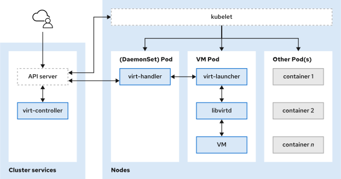

# OCP CNV

#### **virt-controller**:
- The virt-controller operator monitors for new VM objects. When a new VM object is detected, the virt-controller operator creates a pod for the VM and then assigns the pod to a node.
#### **virt-handler**:
- The virt-handler daemon set runs on each node to execute any necessary actions to meet a VM's object defined state and to monitor for changes to a VM object. When a change is detected, virt-handler creates a domain within the libvirtd instance of a VM's pod. If a VM object is deleted, virt-handler turns off the domain within the VM's pod.

#### **virt-launcher**:
- The virt-launcher container runs within each VM's pod and instantiates the VM using a local libvirtd instance.
#### **libvirtd**:
- The libvirtd instance provides a low-level virtualization architecture and interface with the kernel to manage the lifecycle of the VM process.

- When a VM is created and started, a `virt-controller` pod signals a `virt-handler` pod on a cluster node to create a new `virt-launcher pod` for the VMI. The `virt-launcher` pod consists of a running `libvirtd` container instance to execute the VMI as an isolated process.

#### VM Consoles:
- VNC Console (Text&Graphical Based)
- Serial Console (Text Based)
- RDP Console (QEMU guest agent must be installed on the vm)
#### CLI Interface
- virtctl tool (with the oc tool)
- virsh tool (inside a container)
#### Network:
- Default(Cluster) pod network (Masquerade binding method)
- Multus CNI (multiple interfaces to VM, external network = linux-bridge network-attachment-definition)
- SR-IOV (allows a multiple VMI to connect to a virtual function network for high performance.)

#### PV & PVC

#### VMI Execution Pods:
- A virt-launcher pod is created by the virt-controller daemon set when a VM object is started. The virt-launcher pod manages and executes the VMI with a libvirtd container instance.
- When the VMI is provisioned, the virt-launcher pod routes IPv4 traffic to the DHCP address of the VMI. This routing makes it possible to also connect to a VMI with a port-forwarding connection.
