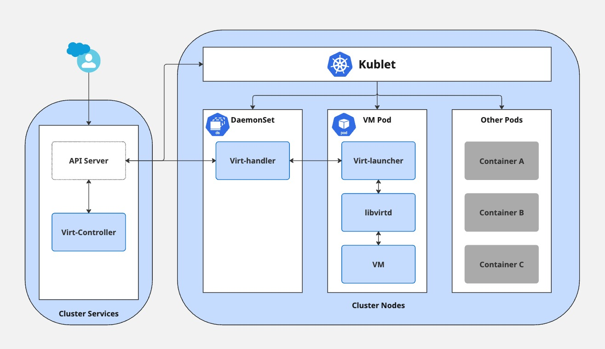

# OpenShift Virtualization

This repository is a personal learning resource created to support preparation for the DO316 certification exam, which focuses on deploying and managing virtual machines (VMs) in Red Hat OpenShift using OpenShift Virtualization.

This GitHub repo serves as a comprehensive and organized knowledge base covering all the major concepts and commands. It's designed for anyone looking to understand the integration of virtualization into Kubernetes-native environments!

## Contents

- **Core Concepts:** Hyperconverged architecture, KubeVirt, CDI, VM lifecycle

- **Hands-on Examples:** Manifests, automation tips, VM creation and migration

- **Troubleshooting & Tips:** Common issues, debug strategies

- **Security & Networking:** VM isolation, SR-IOV, multus, storage

- **Monitoring & Operations:** Metrics, logs, alerts, console features

## Why This Repo?

This repo helps me reinforce key topics by collecting practical insights, curated examples, and cheat-sheets. It will also evolve with feedback and contributions from the community.

## Tech Stack

- **Red Hat OpenShift** (4.x)

- **OpenShift Virtualization** (KubeVirt, CDI)

- **YAML manifests & CLI tools** (oc, virtctl)

## Main Components

### virt-controller

This is the component responsible for creating the pod that runs the VM.
When you create a new VM, the virt-controller sees the new VM object and creates a pod with a virt-launcher container inside it.

### virt-handler

Runs on every node in the cluster. It watches for changes to VM definitions and helps make sure the actual state matches the desired state.
If you start or delete a VM, `virt-handler` helps set things in motion — like telling the node to start or stop the VM.

### virt-launcher

This container lives inside the VM pod and is responsible for running the VM. It uses a tool called `libvirtd` to actually start and manage the virtual machine process.

Each VM gets its own `virt-launcher`, so it's isolated — just like how regular containers are separated from each other.

### libvirtd

This is a low-level virtualization service. It runs inside the VM pod (as part of virt-launcher) and talks directly to the Linux kernel to manage the virtual machine (CPU, memory, storage, etc.).

## Overall Architecture

When you create and start a VM, the `virt-controller` takes care of launching it. It signals the `virt-handler` running on a node to create a new `virt-launcher` pod for the VM (technically called a **VirtualMachineInstance** or **VMI**) and inside that pod, there's a `libvirtd` process that runs the VM as a fully isolated workload.

## VM Consoles

In OpenShift Virtualization, You can connect to running VMs using different types of consoles:

- **VNC Console:** Supports both graphical and text-based access

- **Serial Console:** Text only interface, useful for minimal or server VMs

- **RDP Console:** Requires the QEMU guest agent to be installed on the VM

## CLI Interface

There are a few command-line tools that help manage and interact with VMs:

- **`virtctl`:** KubeVirt CLI helper tool works alongside `oc` and allows actions like start/stop/restart, console access, and port-forwarding.

- **`virsh`:** low-level virtualization CLI. It can be used inside the `virt-launcher` pod to control the VM directly using `libvirtd`

## Networking

There are multiple networking methods I learned for connecting VMs in OpenShift:

- **Default Pod Network (Masquerade mode):** Each VM is attached to the cluster network and NAT is applied. Simple and works out of the box.

- **Multus CNI:** Allows assigning multiple network interfaces to a VM. For example, a VM can be connected to an external physical or bridge-based network using a NetworkAttachmentDefinition

- **SR-IOV:** Gives VMs direct access to a Virtual Function for high performance networking. Ideal for workloads that need low latency and high throughput

## Storage

OpenShift Virtualization uses standard Kubernetes storage, but with some extras provided by the **CDI** (Containerized Data Importer).

- **PVC (PersistentVolumeClaim):** Just like with regular pods, VMs can use PVCs to attach persistent storage. These PVCs are backed by StorageClasses like Local, Ceph, NFS, etc.

- **DataVolume:** This is a higher-level abstraction that wraps a PVC and automatically handles importing or cloning disk images. It makes it easier to:

  - Import images from a URL

  - Clone from another PVC or DataVolume

  - Upload disk images from local storage or the OpenShift console

- **VM Disk Types:**

  - Boot disk: Often created using a DataVolume from a base image (like a Fedora or RHEL cloud image)

  - CloudInitDisk: A special type of disk used to inject configuration data into the VM at boot

  - Additional disks: Can be PVCs or DataVolumes attached for extra storage

- **Live Migrations:** For live migrations to work, the VM’s storage must be on shared storage accessible from all worker nodes (e.g., RWX volumes like CephFS). If using node-local storage (RWO) live migration won’t be possible

## VMI Execution Pods

- When a VM is started, the `virt-controller` creates a special pod called a `virt-launcher`. This pod is responsible for managing the **VMI**

- Inside the pod, `libvirtd` runs the actual VM process and manages its lifecycle

- The pod also handles networking by routing IPv4 traffic to the VMI’s DHCP-assigned IP, which allows access to the VM using `port-forwarding`, even if it's running on the default pod network
